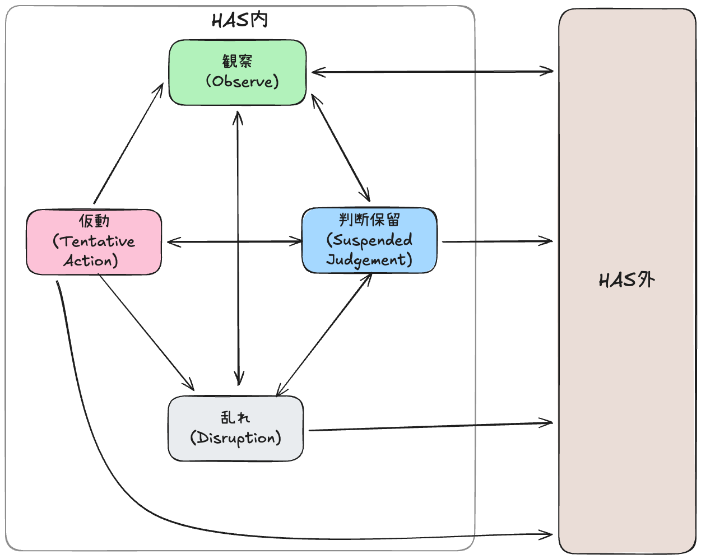

# HAS 調律位置マップ
HAS Attunement Map
― 状態の位置を知るための地図 ―

## この文書の位置づけ

この文書は、HASを**学ぶための段階表**ではない。  
また、実践の巧拙を**評価する基準**でもない。

これは、  
**いま自分がどこにいるかを誤解しないための地図**である。

HASにおいて、この地図が扱うのは、

- 進行
- 成果
- 技巧

ではなく、**選択の余地が失われたときに、位置を取り違えないこと**である。

この地図は、そのために置かれている。

---

## 基本原則

### この地図が示すもの

この地図は、**状態（位置）のみ**を示す。

状態間の移動や戻り方（遷移）は、  
[Patterns](../resources/patterns/README.md) に委ねられている。

**これは、位置を知ることと、動くことを分離するためである。**



```
[HAS外]
  └─(気づく)──────────────────────────▶ 観察

観察
  ├─(判断を保留する)──────────────────▶ 判断保留
  ├─(衝動・不安が増幅)────────────────▶ 乱れ
  └─(結論/完遂/介入固定)────────────▶ [HAS外]

判断保留
  ├─(試しに動く)────────────────────▶ 仮動
  ├─(戻ると判断)────────────────────▶ 観察
  ├─(耐えられなくなる)──────────────▶ 乱れ
  └─(結論/完遂/介入固定)────────────▶ [HAS外]

仮動
  ├─(試行を終える)──────────────────▶ 観察
  ├─(途中で止める)──────────────────▶ 判断保留
  ├─(制御不能)────────────────────▶ 乱れ
  └─(完遂目的化/操作化)────────────▶ [HAS外]

乱れ
  ├─(戻れると判断)──────────────────▶ 観察
  ├─(一段階戻る)──────────────────▶ 判断保留
  └─(操作・結論化)────────────────▶ [HAS外]
```

### 地図の読み方

- ここに示されるのは「段階」ではなく**位置**である  
- 上下・優劣・到達順序は存在しない  
- どの位置からでも、**観察に戻れる**

ここでいう「戻る」は、優劣や進捗を示すものではない。  
位置を再同定する判断が行われた時点で、HASの前提条件は満たされている。

### HASが成立する前提条件

位置はすべて以下の前提の上に成り立つ：

- 結論を確定していない（判断を閉じていない）
- 完遂を目的化していない
- 介入を「やるべきこと」として固定していない（操作モードになっていない）

これらの前提が満たされていない場合、その状態は HAS の外にある。

---

## HAS外の兆候（重要）

以下のいずれかが起きている場合、現在の状態は **HAS外**にある。

- 結果を良くしようとして介入している
- 意味づけ・評価・結論を下している
- 完遂・成功・変化を目標に動いている
- 「正しくやれているか」を気にしている
- 「この方法でいく」と手段を固定している（切り替え不能になっている）

### HAS外にいる場合の対応

この場合、状態を特定しようとする前に、観察という位置が立ち上がることがある。  
観察が立ち上がっている場合、その時点で状態は HAS内にある。

---

## 4つの位置（States）

### 観察（Observation）

観察は、HAS内で参照されうる位置の一つである。

初心者も、経験者も区別されない。  
ここは、準備や前段階として位置づけられるものではない。

#### 内部定義

刺激に対して生じつつある身体反応を、意味づけや感情名を与えずに認知している状態。  
判断はまだ立ち上がっていない。

#### この位置にいる兆候（例）

以下は、この位置にあるときに見られることのある身体的・内的な例である。  
すべてが当てはまる必要はなく、確認や評価のための項目ではない。

- 身体の緊張や違和感がある
- 衝動が立ち上がりつつある感じがある
- 判断や結論が、まだはっきりしていない
- 呼吸や身体反応が過度に抑え込まれていない

#### 観察における Patterns との関係

観察にいるとき、P01–P04 はいずれも実行されない。  
**それで HAS は成立している。**

#### 注意

**※HAS外条件**: 結論／完遂／介入固定が立ち上がった場合、その状態は HAS外にある。

- 何もしないことは放棄ではない  
- 介入しない判断は、責任の放棄ではない  
- 観察に留まっていること自体も、HAS内における選択肢の一つである。

---

### 判断保留（Suspended Judgment）

この位置は、結果の改善を目的としない。  
判断が確定されていない状態が維持されている位置である。

#### 内部定義

観察の結果、起きていることや感じていることを、解釈前の“事実”として扱って受け取っているが、その意味付けや解釈、次の行為に関する判断は宙吊りにされている状態。

選択の余地を奪わないため介入の制限が起きている。

**哲学的には、エポケー（判断中止）に相当する状態。**

#### この位置にいる兆候（例）

以下は、この位置にあるときに見られることのある例である。  
すべてが当てはまる必要はなく、確認や評価のための項目ではない。

- 介入したい衝動が生じている
- 状態が整っていないまま、結論が確定していない
- 進行や完遂が前景化していない
- 停滞や沈黙が、ただちに問題化されていない

#### 判断保留における Patterns との関係

判断保留では、P01 が自然に立ち上がることがあるが、  
**それ以上進まなくてもよい。**

#### 注意

**※HAS外条件**: 結論／完遂／介入固定が立ち上がった場合、その状態は HAS外にある。

- 結果（良くなった／悪くなった）によって位置は判定されない  
- 自己評価や熟達度の判断には用いない  
- 事後評価を前提としない

---

### 仮動（けどう / Tentative Action）

仮動とは、「一巡を完遂すること」ではない。  
**進まないという判断を含んだ試行**である。

#### 内部定義

**仮動（けどう）**: 仮に動いてみること。本実行や完遂を目的としない試行的な行為状態。

P01から入り、試行的に動いているが、完遂を目指していない状態。  
成果への期待も、評価の対象化もされていない。

#### この位置にいる兆候（例）

以下は、この位置にあるときに見られることのある例である。  
すべてが当てはまる必要はなく、確認や評価のための項目ではない。

- P01 から入り、試行が途中で終わっている
- 状態の変化が、ただちに失敗として扱われていない
- 試行が完遂や結論に結びついていない
- 成果や進捗が前面に出ていない

#### 仮動における Pattern との関係

仮動は、P01 から入り、途中で止まることを含む。  
**P04 に至らなくても失敗ではない。**

#### 仮動からの遷移（重要）

試行が終わり、再び観察が立ち上がる。  
これは、失敗や乱れを意味するものではない。

#### 注意

**※HAS外条件**: 結論／完遂／介入固定が立ち上がった場合、その状態はHAS外にある。

- Pattern を道具として切り出さない  
- 「P03 だけを使う」という発想を持たない  
- 一部だけを「やろう」とした瞬間、断片化が始まる

---

### 乱れ（みだれ / Disruption）

HAS は、失敗しない体系ではない。  
**戻れる体系**である。

乱れは、「失敗」ではなく、**位置**である。

#### 内部定義

主体または場の関係が乱れており、継続が難しい状態。

乱れは、必ず通過すべき関門ではない。  
**破綻時・失敗時に現れる非常口**である。

#### この位置にいる兆候（Signs）

- 自分または場の関係が乱れている
- 焦りが強い
- 介入衝動が抑えられない
- 沈黙に耐えられない
- 継続が難しいと感じている

#### 乱れからの戻り

この位置から、観察 または 判断保留 が再び立ち上がる。

その時点で、乱れは記述可能な位置として扱われる。

#### 注意

**※HAS外条件**: 結論／完遂／介入固定が立ち上がった場合、その状態はHAS外にある。

- 乱れは評価や非難の対象ではない  
- 遷移を正当化する必要はない  
- 観察または判断保留が立ち上がっている場合、その状態はHAS内にある。

---

### 遷移の詳細

遷移の方法は、以下を参照：  
- [Patterns P01–P04](../resources/patterns/state/)  
- [緊急停止プロトコル](../governance/protocols/emergency_stop.md)

---

## 自己確認の問い

### 1. まず、HASの中にいるか確認する

以下のいずれかに該当する場合、HAS外にいる：

- 結果を良くしようとしている
- 評価・結論を下している
- 完遂を目指している
- 「正しくやれているか」を気にしている
- 手段を固定している（切り替え不能になっている）

→ 観察が参照される

### 2. HASの中にいる場合、位置を確認する

いま、私はどこにいるか？

1. **何も介入していない** → 観察  
2. **介入しないよう抑えている** → 判断保留  
3. **進んでいるが完遂を目指していない** → 仮動  
4. **乱れており、戻りたい** → 乱れ

### 重要な注意

- この問いは、**評価のためではない**  
- 位置を知ることで、次の判断が可能になる  
- どの位置にいても、**観察**に戻れる

---

## この地図の限界

### この地図が示さないもの

- 遷移の方法（どう動くか）  
- Patterns の使い方（何をするか）  
- 成果の評価（うまくいったか）

これらは、他の文書が担当する。

### この地図が示すもの

- 位置の識別（どこにいるか）  
- 遷移の可否（HAS外条件に該当していないか）  
- 許可の範囲（やらなくていいこと）

**この地図は、動かすための設計書ではない。**  
**迷子にならないための地図である。**

---

## 関連文書

### 遷移と循環について
- [全体設計図](./01_architecture_map.md) — HAS全体の構造  
- [Patterns P01–P04](../resources/patterns/state/) — 状態遷移の構造

### 位置の詳細について

- [判断参照原則](./03_principle.md) - 優先する判断の基準  
- [ファシリテーター役にありがちな状態例](./05_facilitator_common_states.md) - よくある状態

### 緊急時の対応

- [緊急停止プロトコル](../governance/protocols/emergency_stop.md) — 緊急停止の手続き

---

**この地図は、進むためのものではない。**  
**選択の余地を狭めずに、居続けるためのものである。**

---

<!-- DOCCTRL:START -->
## Document Control
- **Repo Version:** v2.5.0-33-g8c360ffa-dirty
- **Last Modified:** 2026-01-23
- **Commit:** 47b68e0
- **Author:** Takeshi Kakeda
<!-- DOCCTRL:END -->