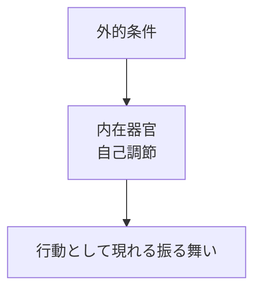
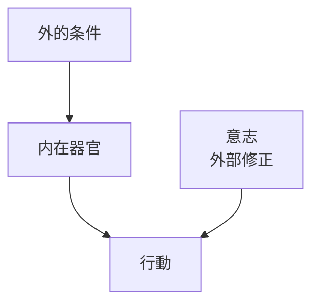
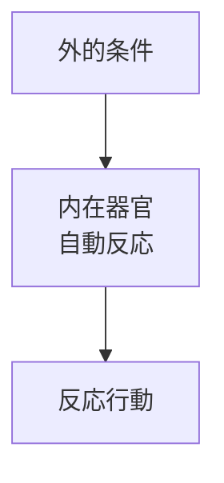
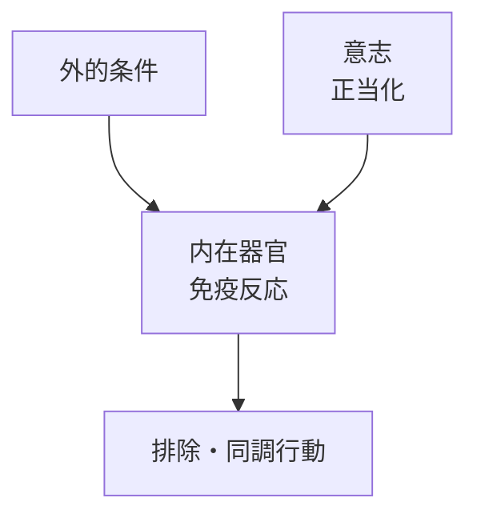
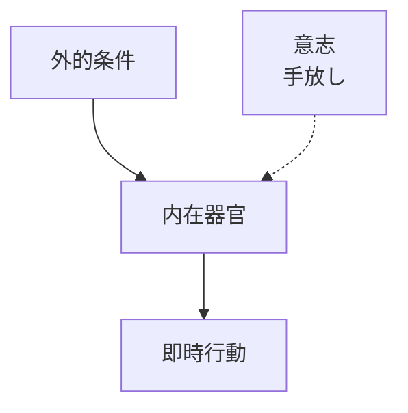
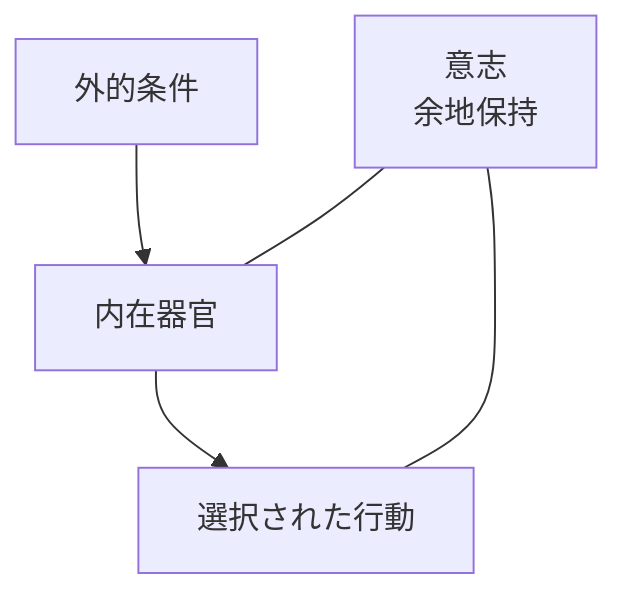

# 器官と位置に関しての図解

## 共通

## 調整

- 器官はそのまま
- 行動だけが書き換えられる
- 反応と行動が乖離

## 適応

意志が介在しない。

- 器官＝行動
- 選択の余地なし
- 生存には強いが主権はない

## 適合

意志が反応を正当化。

- 意志が反応側につく
- 反応が「正しい行動」に昇格
- 固着が起きやすい

## 即興

- 意志が制御を放棄
- 創発も暴走も起き得る
- 境界は不安定

## 調律

意志が「間」に留まる。

- 意志はどこも操作しない
- 反応と行動の間に「間」を作る
- 反応 ≠ 行動 が可能になる

## 状態

| 観点 | 調整 | 適応 | 適合 | 即興 | 調律 |
|---|---|---|---|---|---|
| **器官** | 使わない | 作動する（生理反射） | 作動する（免疫反応） | 作動する（衝動・表現） | 作動する（自己調節） |
| **意志の有無** | あり | なし | あり | あり | あり |
| **意志の位置** | 外部操作（行動・条件） | 不在 | 正当化（規範付与） | 手放し | 間に留まる |
| **反応の性質** | 反応を無視 | 自動・閉 | 自動＋固定 | 自発・開 | 感知のみ |
| **選択の有無** | 反応外で選択 | なし | 疑似的（正しさ依存） | あり | あり |
| **停止可能性** | 高い | ない | 低い | あるが選ばない | ある |
| **境界の扱い** | 外部ルール | 生理的 | 規範的 | 不安定 | 構造的に保持 |
| **典型的な破綻** | 火消し依存 | 摩耗 | 排除・硬直 | 暴走 | 宙づり |

適応   : 意志なし
即興   : 意志あり（流れる）
調律   : 意志あり（留まる）