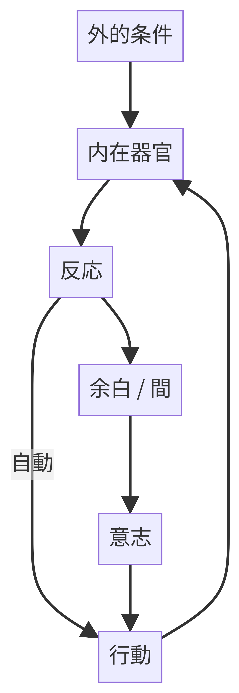
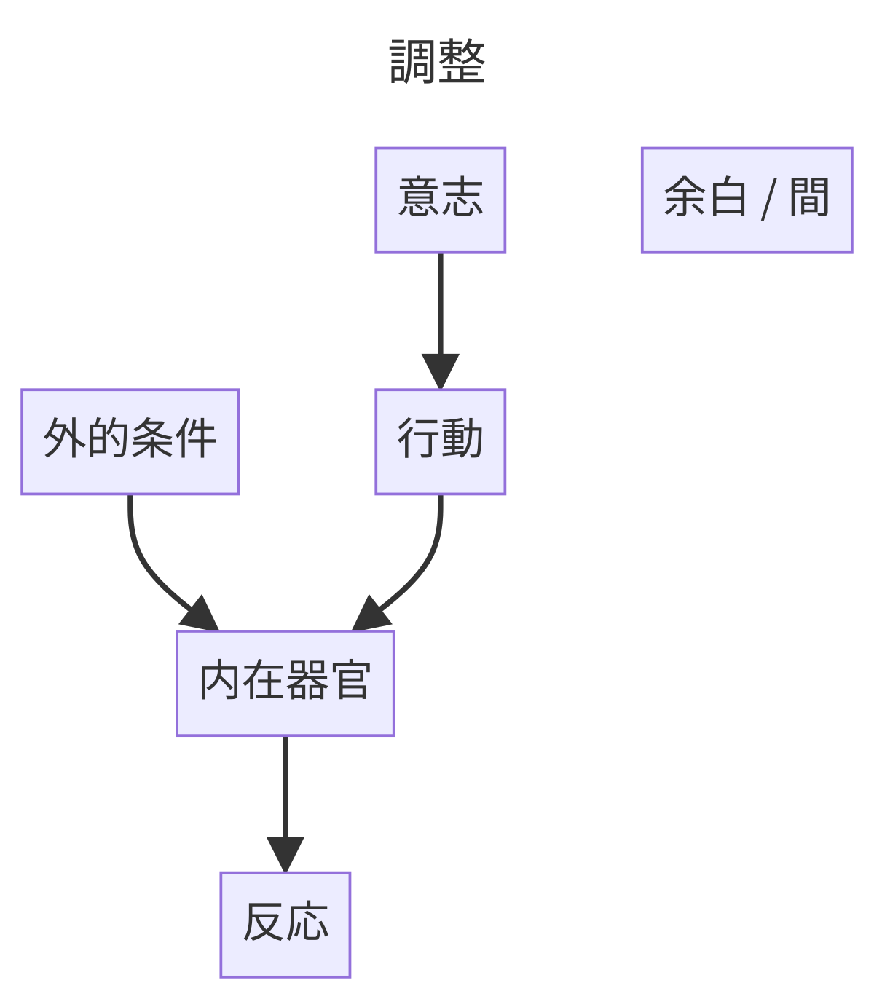
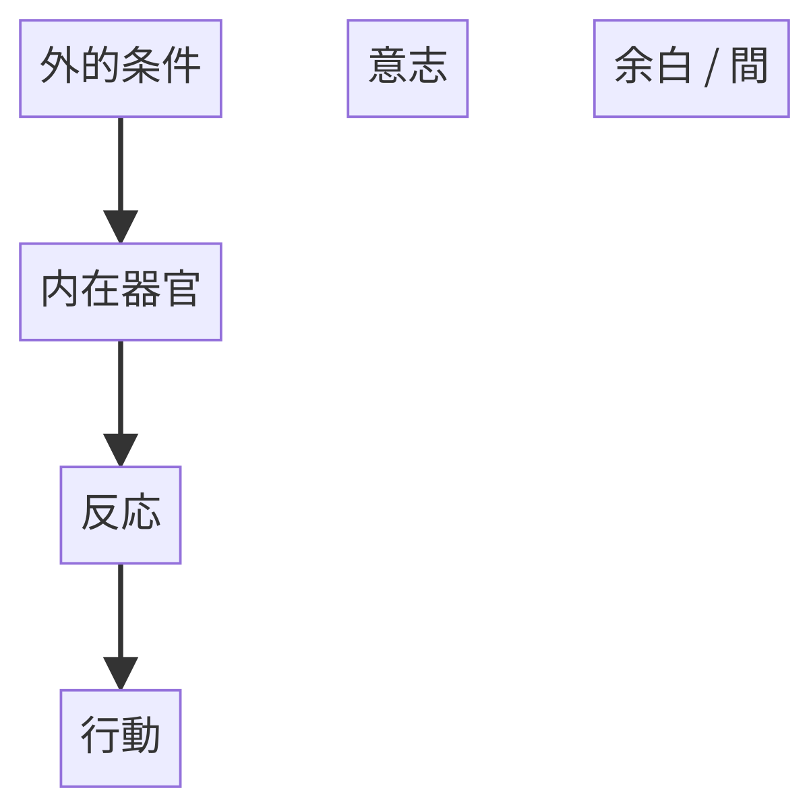
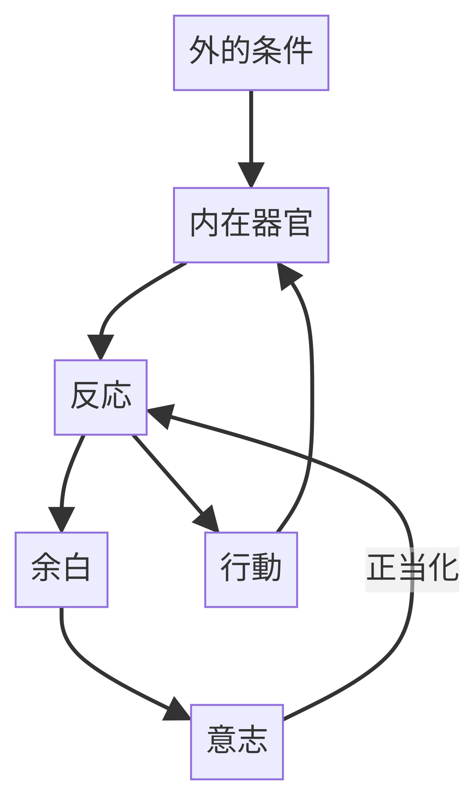
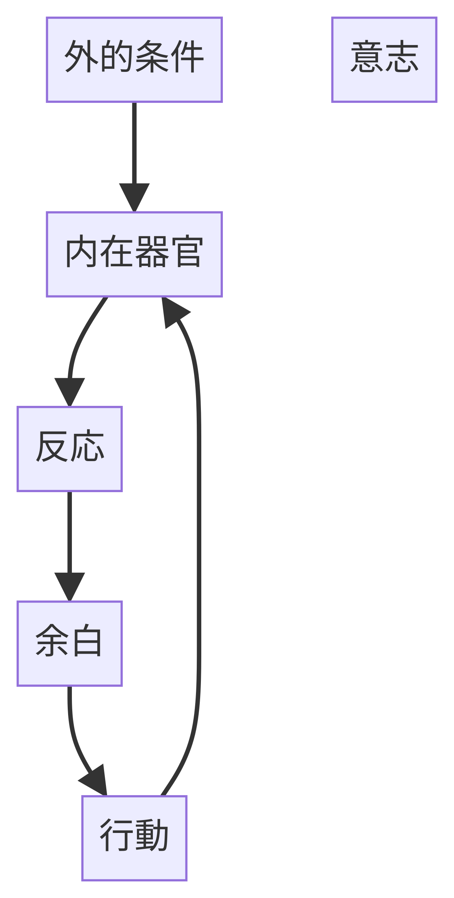
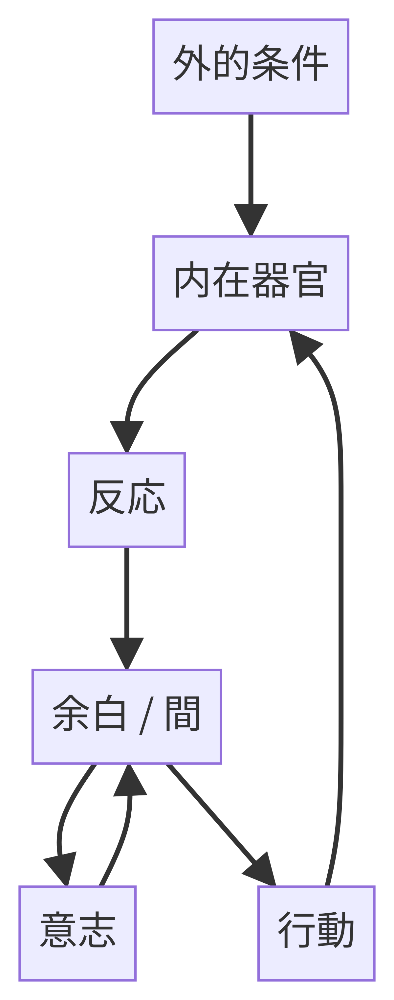

# 器官と位置に関しての図解

## 注意

本ドキュメントは、HASにおける位相整理が行われる以前に作成されたものであり、
現在のConcept（ADR-029）で示されている位相区分とは一致しない。

そのため、ここで示されている配置や比較は、
現在のHASの説明体系においては参照対象外（Outdated）である。

## 共通

※ この図は、人の行動が立ち上がる基本構造を示している。
　意志がどこに置かれるか、また介在するかどうかは、
　以降の各配置（調整・適応・適合・即興・調律）で異なる。

## 調整

意志が内在器官に触れず、結果として現れた行動だけを書き換えようとする配置である。

- この配置では、意志は行動側に介入する。
- 器官そのものは変えられず、行動だけが書き換えられる。
- その結果として、反応と行動の乖離が生じやすい。
- 火消しや対症処理が連鎖しやすく、根本構造は残りやすい。

## 適応

意志が介在しない。

- この配置では、意志は構造上介在しない。
- 刺激と反応が器官を通じて直結している。
- その結果として、行動は反射的・自動的になる。
- 選択や停止の余地は、結果として失われている。

## 適合

意志が反応を正当化する。

- この配置では、意志が反応側（免疫反応）に結びつく。
- 反応は「正しい行動」として意味づけられる。
- その結果として、行動が規範化・固定化しやすくなる。
- 排除や硬直が、構造的に再生産されやすい。

## 即興

- この配置では、意志は制御や固定を行わない。
- 器官の出力が、そのまま行動として表出しやすい。
- その結果として、創発も暴走も同時に起こり得る。
- 境界は流動的で、安定は構造的に保証されない。

## 調律

意志が「間」に留まる。

- この配置では、意志は反応も行動も操作しない。
- 反応と行動の間に、構造的な「間」が保たれる。
- その結果として、反応と行動を分離して扱える。
- 選択や停止が、結果として可能な状態になる。

## 状態

| 観点 | 調整 | 適応 | 適合 | 即興 | 調律 |
|---|---|---|---|---|---|
| **器官** | 使わない | 作動する（生理反射） | 作動する（免疫反応） | 作動する（衝動・表現） | 作動する（自己調節） |
| **意志の有無** | あり | なし | あり | あり | あり |
| **意志の位置** | 外部操作（行動・条件） | 不在 | 正当化（規範付与） | 手放し | 間に留まる |
| **反応の性質** | 反応を無視 | 自動・閉 | 自動＋固定 | 自発・開 | 感知のみ |
| **選択の有無** | 反応外で選択 | なし | 疑似的（正しさ依存） | あり | あり |
| **停止可能性** | 高い | ない | 低い | あるが選ばない | ある |
| **境界の扱い** | 外部ルール | 生理的 | 規範的 | 不安定 | 構造的に保持 |
| **典型的な破綻** | 火消し依存 | 摩耗 | 排除・硬直 | 暴走 | 宙づり |

- 適応 : 意志なし
- 即興 : 意志あり（流れる）
- 調律 : 意志あり（留まる）