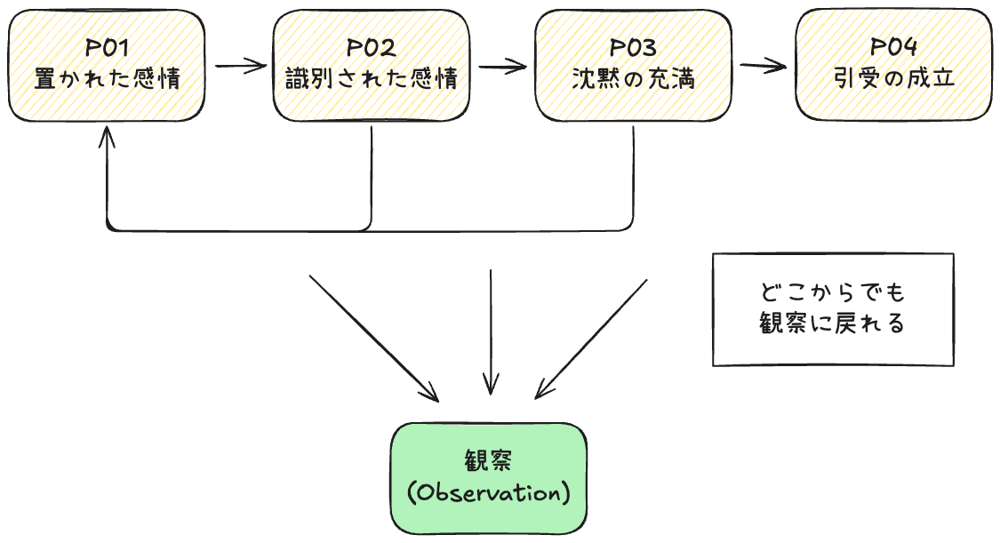

# 状態パタン

状態を「やっていること」ではなく
「**見えている様子**」として捉える

## この文書の目的

この文書は、状態パタン（P01–P04）を実践手順や内面理解として説明しない。

ここで扱うのは、**場や人に「どう見えるか」「どんな雰囲気として現れるか」**という外観のみ。

- 良し悪しを判定しない
- 正しい使い方を示さない
- 次に何をすべきかは決めない

「今、どの状態に“見えるか”」を誤認しないための補助資料である。

⸻

これらは、行為や介入を**指示・推奨する形では一切含まない**。

State Pattern が扱うのは以下の2点のみ。

- 介入や操作が「起きていない／起き始めていないか」を含む、**状態の識別基準**
- 状態が壊れないように、その場に留まり続けるため**微調整**

状態パタンは「行為」ではなく「様相」なので、
HASにおける状態パタンは、誰かが何かを「している」状態ではない。

- 技法が使われているかどうかではない
- ファシリテーターの意図でもない
- 発言内容の正しさでもない

結果として、場に立ち現れている様相である。

したがって、同じ発言でも、状態が違えば外観は異なる。